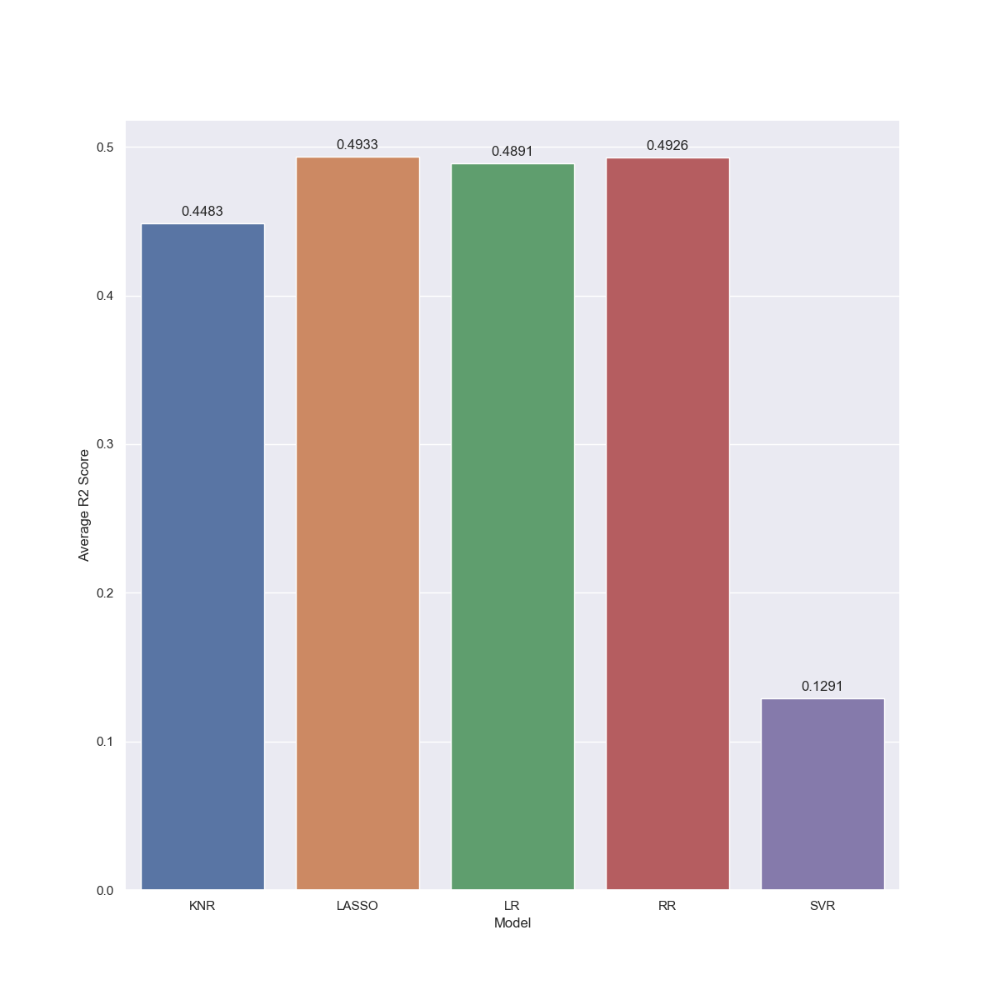

# CEBD-1160-Project

# Diabetes Dataset

| Name | Date |
|:-------|:---------------|
|Hakim TAMAGLT|December 7, 2019|

-----

### Resources
Your repository should include the following:

- Python script for your analysis: `network_analysis.py`
- Results figure/saved file:  `figures/`
- Dockerfile for your experiment: `Dockerfile`
- runtime-instructions in a file named RUNME.md

-----

## Initial Research Question

Find correlation between age/BMI to determine the illness progress one year after baseline.

## More Refined Research Question

More in depth study of the correlation values between features and the target, gave more insights about how we should refine the reserach question, Based on 

### Abstract

Ten baseline variables, age, sex, body mass index, average blood pressure, and six blood serum measurements were obtained for each of n = 442 diabetes patients, as well as the response of interest, a quantitative measure of disease progression one year after baseline.
Number of Attributes:442
First 10 columns are numeric predictive values
Target:	Column 11 is a quantitative measure of disease progression one year after baseline Y

Attribute Information:
Age, Sex, Body mass index, Average blood pressure, S1, S2, S3, S4, S5, S6

### Introduction

We started our study by visualizing our data to give us more insight about how features are structured and related to Target.

### Methods

We started our study by testing 5 regressors models, Linear Regression, Lasso Regression, Ridge Regression,  k-nearest neighbors & Epsilon-Support Vector Regression (SVR).

For Lasso & Ridge Regressors we iterated over the value of alpha coefficient to find the best optimized value that leads to best R2 Score.

For k-nearest neighbors, we iterated over the values of number of neighbors to find the best optimized vale that leads to best R2 Score.

The idea was to find the best possible score for all of those regressors' models, we run our models in a 20 iterations loop and collected R2 Scores & Mean Squared Error.

The following figure show the average & max R2 Scores collected during our tests.

### Results

The performance of the regressor was an R^2 value of 0.661. The figure below shows the performance on the testing set.

We can see that in general, our regressor seems to underestimate our edgeweights. In cases where the connections are small, the regressor performs quite well, though in cases where the strength is higher we notice that the
performance tends to degrade.

### Discussion

The method used here does not solve the problem of identifying the strength of connection between two brain regions from looking at the surrounding regions. This method shows that a relationship may be learnable between these features, but performance suffers when the connection strength is towards the extreme range of observed values. To improve this, I would potentially perform dimensionality reduction, such as PCA, to try and compress the data into a more easily learnable range.

### References
The links referenced were included in my discussion, above.

https://www4.stat.ncsu.edu/~boos/var.select/diabetes.html

https://scikit-learn.org/stable/tutorial/machine_learning_map/index.html

https://scikit-learn.org/stable/auto_examples/linear_model/plot_ols.html#sphx-glr-auto-examples-linear-model-plot-ols-py

https://machinelearningmastery.com/linear-regression-for-machine-learning/

https://scikit-learn.org/stable/modules/model_evaluation.html

https://towardsdatascience.com/a-beginners-guide-to-linear-regression-in-python-with-scikit-learn-83a8f7ae2b4f

https://towardsdatascience.com/machine-learning-workflow-on-diabetes-data-part-01-573864fcc6b8

https://realpython.com/pandas-groupby/

https://towardsdatascience.com/feature-selection-with-pandas-e3690ad8504b

-------
