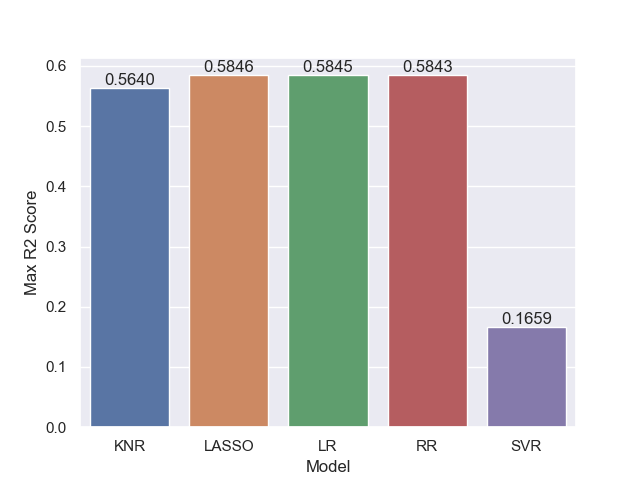

# CEBD-1160-Project

# Diabetes Dataset

| Name | Date |
|:-------|:---------------|
|Hakim TAMAGLT|December 7, 2019|

-----

## Initial Research Question

Find correlation between age/BMI to determine the illness progress one year after baseline.

## More Refined Research Question

More in depth study of the correlation values between features and the target, gave more insights about how we should refine the reserach question, Based on 

### Abstract

Ten baseline variables, age, sex, body mass index, average blood pressure, and six blood serum measurements were obtained for each of n = 442 diabetes patients, as well as the response of interest, a quantitative measure of disease progression one year after baseline.

Number of Attributes:442

First 10 columns are numeric predictive values

Target:	Column 11 is a quantitative measure of disease progression one year after baseline Y

Attribute Information:

Age, Sex, Body mass index, Average blood pressure, S1, S2, S3, S4, S5, S6

### Introduction

We started our study by visualizing our data to give us more insight about how features are structured and related to Target.

Before we started our testing we used the SciKit Learn Algorithms Cheat Sheet to determine the best regressors candidates for our study.

### Methods

We started our study by testing 5 regressors models, Linear Regression, Lasso Regression, Ridge Regression,  k-nearest neighbors & Epsilon-Support Vector Regression (SVR).

For Lasso & Ridge Regressors we iterated over the value of alpha coefficient to find the best optimized value that leads to best R2 Score.

For k-nearest neighbors, we iterated over the values of number of neighbors to find the best optimized vale that leads to best R2 Score.

The idea was to find the best possible score for all of those regressors' models, we run our models in a 20 iterations loop and collected R2 Scores & Mean Squared Error in step 1.

we selected the best results, in our case the following regressors Linear Regression, Lasso Regression & Ridge Regression were showing average R2 Score around 48%, with Max values around 49%.

The follow step was to determine if we could improve this R2 Score by finding a way to drop highly correlated features. and re-run simulation using the optimized values of cofficient alpha found above for Lasso & Ridge regressions.

### Results

The following figure show the average & max R2 Scores collected during our first Step.

-------

In Step 2, we review our Heat Map and focussed on features with correlation values  greater than 40%.

-------

The highly correlated feature were:

| Feature | Correlation |
|:-------|:---------------|
|bmi|0.586450|
|bp|0.441484|
|s4|0.430453|
|s5|0.565883|
|Y|1.000000|

As seen above the potential candiates were bmi, bp, s4, s4, our next step was to see how these feature are related to each other to see if we could drop any of them.

| |bmi | bp |
|:-----|:-------|:---------------|
|bmi|1.000000|0.395415|
|bp|0.395415|1.000000|

| |bmi | s4 |
|:-----|:-------|:---------------|
|bmi|1.000000|0.413807|
|s4|0.413807|1.000000|

| |bmi | s5 |
|:-----|:-------|:---------------|
|bmi|1.000000|0.446159|
|s5|0.446159|1.000000|

| | bp | s4 |
|:-----|:-------|:---------------|
|bp|1.000000|0.257653|
|s4|0.257653|1.000000|

| | bp | s5 |
|:-----|:-------|:---------------|
|bp|1.000000|0.393478|
|s5|0.393478|1.000000|

| | s4 | s5 |
|:-----|:-------|:---------------|
|s4|1.000000|0.617857|
|s5|0.617857|1.000000|

From the above it is clear that s4 is highly correlated to s5 and since s5 has a higher correlation to Y then we will drop s4. and re-run our simulation.

The following results were obtained for R2 Score average & max values.

-------

### Discussion

The methods used here does not solve the problem of improving the performance score of our model, even though we were able to slightly increase the Max value to 61% from 58% the average value fell from 49% to 47%, further analysis is required for deeper understanding, my guess is that if we have more data we could've obtained better result the number of patients = 442 remains a small sample.

### References
The links referenced were included in my discussion, above.

https://www4.stat.ncsu.edu/~boos/var.select/diabetes.html

https://scikit-learn.org/stable/tutorial/machine_learning_map/index.html

https://scikit-learn.org/stable/auto_examples/linear_model/plot_ols.html#sphx-glr-auto-examples-linear-model-plot-ols-py

https://machinelearningmastery.com/linear-regression-for-machine-learning/

https://scikit-learn.org/stable/modules/model_evaluation.html

https://towardsdatascience.com/a-beginners-guide-to-linear-regression-in-python-with-scikit-learn-83a8f7ae2b4f

https://towardsdatascience.com/machine-learning-workflow-on-diabetes-data-part-01-573864fcc6b8

https://realpython.com/pandas-groupby/

https://towardsdatascience.com/feature-selection-with-pandas-e3690ad8504b

-------

